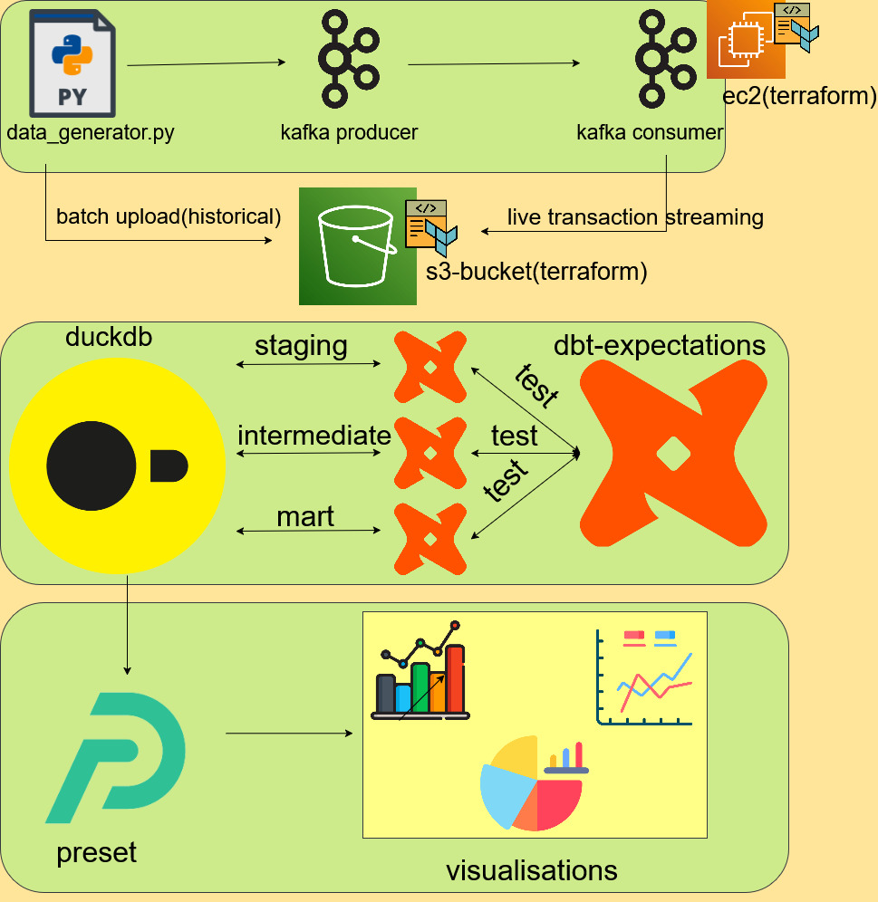
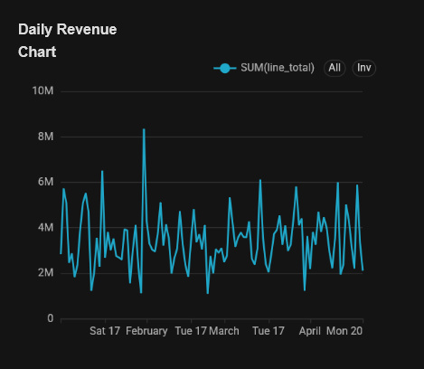
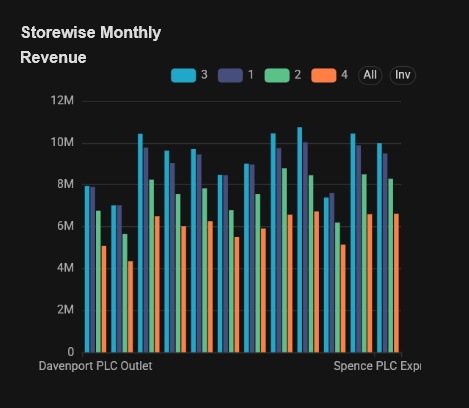
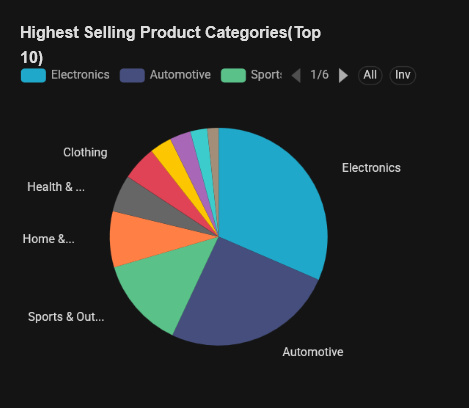

# 🛒 Retailitics - Retail Analytics Pipeline

**End-to-End Batch Data Engineering Project with dbt**

A production-grade retail analytics system processing historical transaction data to deliver actionable business insights through interactive dashboards. Built for a simulated 12-store retail chain with comprehensive data quality testing.


---

## 📋 Table of Contents

- [Problem Statement](#problem-statement)
- [Architecture Overview](#architecture-overview)
- [Technologies Used](#technologies-used)
- [Project Structure](#project-structure)
- [Setup Instructions](#setup-instructions)
- [Running the Pipeline](#running-the-pipeline)
- [Dashboard](#dashboard)
- [Data Quality](#data-quality)
- [Future Enhancements](#future-enhancements)

---

## 🎯 Problem Statement

### Business Context

Retail businesses generate massive amounts of transaction data daily. Without proper data infrastructure, this valuable information remains underutilized, preventing data-driven decision making for inventory management, store performance optimization, and customer insights.

### The Challenge

Build a **scalable batch data pipeline** that:

1. **Ingests** historical transaction data from cloud storage (AWS S3)
2. **Transforms** raw data into business-ready metrics through a medallion architecture (Bronze → Silver → Gold)
3. **Validates** data quality with comprehensive automated testing
4. **Delivers** insights via interactive dashboards for business stakeholders

### Solution

This project implements a **retail analytics platform** simulating a 12-store retail chain with:
- **Cloud storage** on AWS S3 for raw transaction files
- **Orchestrated pipelines** using Apache Airflow for scheduling and monitoring
- **Data warehouse** using DuckDB with dbt transformations (Raw → Staging → Intermediate → Mart )
- **290+ data quality tests** ensuring data integrity
- **Executive dashboards** on Preset (Apache Superset) for business analytics

---

## 🏗️ Architecture Overview

### Data Flow Details

1. **Generation**: Python script generates realistic retail transactions
   - 12 stores
   - 500 customers with purchase history
   - 100 products across multiple categories
   - Realistic variance in daily sales patterns

2. **Storage**: Parquet files uploaded to AWS S3
   - Organized by date: `retail_data/transactions/transactions_YYYYMMDD.parquet`
   - Parquet format for optimized storage and querying
   - IAM-secured access with least-privilege principle

3. **Orchestration**: Apache Airflow schedules daily batch processing
   - **DAG 1**: S3 → DuckDB ingestion
   - **DAG 2**: dbt transformation (Raw → Staging → Intermediate → Mart)
   - **DAG 3**: dbt test execution (290+ quality checks)

4. **Transformation**: dbt models with medallion architecture
   - **Raw**: Raw data views (read directly from S3)
   - **Staging/Intermediate**: Cleaned, typed, deduplicated data
   - **Mart**: Business-ready metrics and dimensions
   - **Testing**: Comprehensive data quality validation

5. **Warehouse**: DuckDB embedded analytical database
   - Optimized for OLAP queries
   - Partitioned by date for fast queries
   - Columnar storage for aggregation performance

6. **Visualization**: Preset (Apache Superset) dashboards
   - Daily revenue trends
   - Store performance comparison
   - Product category analysis

---

## 🛠️ Technologies Used

### Cloud & Infrastructure
- **AWS S3**: Data lake storage for raw transaction files
- **Terraform**: Infrastructure as Code for reproducible S3 provisioning

### Data Orchestration
- **Apache Airflow**: Workflow scheduling and monitoring
- **Docker Compose**: Containerized development environment

### Data Warehouse & Transformation
- **DuckDB 1.22**: Embedded analytical database (OLAP)
- **dbt (Data Build Tool)**: SQL-based transformations with testing
  - Medallion Architecture: Bronze → Silver → Gold
  - 290+ data quality tests (dbt-utils, dbt-expectations)
  - Incremental models for efficient rebuilds

### Visualization
- **Preset** (Apache Superset): Executive analytics dashboards
  - Daily revenue trends
  - Store-wise monthly revenue comparison
  - Top 10 product categories by sales

### Development Tools
- **WSL2**: Windows Subsystem for Linux for development
- **Python 3.12**: Data generation and ETL scripts
- **Git**: Version control and collaboration

---

## 📁 Project Structure

```
├── README.md
├── airflow
│   ├── Dockerfile
│   ├── config
│   ├── dags
│   ├── docker-compose.yaml
│   ├── logs
│   ├── plugins
│   └── requirements.txt
├── project-workflow.jpg
├── retailitics_dbt
│   ├── README.md
│   ├── analyses
│   ├── dbt_packages
│   ├── dbt_project.yml
│   ├── info
│   ├── logs
│   ├── macros
│   ├── models
│   ├── package-lock.yml
│   ├── packages.yml
│   ├── profiles.yml
│   ├── requirements.txt
│   ├── seeds
│   ├── snapshots
│   ├── target
│   ├── tests
│   ├── warehouse.duckdb
│   └── warehouse_bi.duckdb
├── scripts
│   ├── __pycache__
│   ├── data_generation
└── terraform
    ├── bucket.tf
    └── provider.tf
```

---

## 🚀 Setup Instructions

### Prerequisites

- **Docker Desktop** (Windows/Mac) or **Docker + Docker Compose** (Linux)
- **Python 3.12+**
- **AWS Account** with S3 access
- **Preset Cloud Account** (free tier available)
- **Git**

### 1. Clone Repository

```bash
git clone https://github.com/sakrak-hub/Project-2-Retail-Analytics-Pipeline.git
```

### 2. Configure Environment Variables

```bash
# Copy example env file
cp .env.example .env

# Edit .env with your credentials
nano .env
```

**Required variables:**
```bash
# AWS Credentials
AWS_ACCESS_KEY_ID='AWS_ACCESS_KEY_ID'
AWS_SECRET_ACCESS_KEY='AWS_SECRET_ACCESS_KEY'
motherduck_token="motherduck_token"

# DuckDB Settings
DUCKDB_DATABASE_PATH=./your-dbt-folder/warehouse.duckdb

# Airflow Settings
AIRFLOW_UID=50000
AIRFLOW_GID=0
AIRFLOW__CORE__EXECUTOR=LocalExecutor
AIRFLOW__CORE__LOAD_EXAMPLES=False
```

### 3. Provision AWS Infrastructure

```bash
cd terraform

# Initialize Terraform
terraform init

# Review planned changes
terraform plan

# Apply infrastructure
terraform apply

# Note the S3 bucket name from output
cd ..
```

### 4. Generate Sample Data

```bash
# Install Python dependencies
pip install -r requirements.txt

# Generate transaction for 2026/01/01
python scripts/data_generator.py 2026 1 1

### 5. Start Airflow

```bash
# Initialize Airflow database
docker-compose up airflow-init

# Start all services
docker-compose up -d

# Check status
docker-compose ps
```

**Access Airflow UI**: http://localhost:8080
- Username: `airflow`
- Password: `airflow`

### 6. Configure dbt

```bash
# Test dbt connection
docker exec -it airflow-webserver bash
cd /opt/airflow/dbt_project
dbt debug

# Run dbt models
dbt run

# Run data quality tests
dbt test
```

### 7. Connect Preset to DuckDB

**Option 1: Direct File Access** (Local Development)
- Upload `retail_analytics.duckdb` to cloud storage
- Connect Preset to file URL

**Option 2: MotherDuck** (Recommended for Production)
- Create MotherDuck account (cloud DuckDB)
- Sync local DuckDB to MotherDuck
- Connect Preset to MotherDuck database

---

## 📊 Dashboard

### Preset Analytics Dashboard

**Access**: [https://c26629ef.us2a.app.preset.io/superset/dashboard/2/?native_filters_key=GkFKrpLoOIY]

**Dashboard Name**: Retailitics Dashboard

---

#### Chart 1: Daily Revenue Trend 📈

**Chart Type**: Line Chart

**Configuration**:
- **X-Axis**: `transaction_date` (Date dimension)
- **Y-Axis**: `SUM(line_total)` (Daily revenue)
- **Time Grain**: Day
- **Date Range**: 2026/01/01-Current Date

**SQL Query**:
```sql
SELECT
  DATE_TRUNC('DAY', transaction_date) AS transaction_date,
  SUM(line_total) AS "SUM(line_total)"
FROM warehouse_bi.mart_db.fact_sales
WHERE
  TRUE
GROUP BY
  DATE_TRUNC('DAY', transaction_date)
ORDER BY
  "SUM(line_total)" DESC
```

**Business Insight**: 
- Identify revenue trends and seasonality
- Detect anomalies in daily sales patterns
- Monitor day-of-week effects (weekends vs weekdays)


---

#### Chart 2: Storewise Monthly Revenue 🏪

**Chart Type**: Grouped Bar Chart

**Configuration**:
- **X-Axis**: `store_name` (Month)
- **Y-Axis**: `SUM(line_total)` (Revenue)
- **Series/Breakdown**: `transaction_month` (Creates grouped bars)
- **Y-Axis Format**: `$0.00a` (Shows millions)
- **Sort**: By month ascending

**SQL Query**:
```sql
SELECT
  store_name AS store_name,
  transaction_month AS transaction_month,
  SUM(line_total) AS "SUM(line_total)"
FROM warehouse_bi.mart_db.fact_sales
WHERE
  TRUE
GROUP BY
  store_name,
  transaction_month
ORDER BY
  "SUM(line_total)" DESC
```

**Business Insight**:
- Compare store performance month-over-month
- Identify high and low performing stores
- Detect seasonal patterns by store location
- Support resource allocation decisions


---

#### Chart 3: Top 10 Product Categories 📦

**Chart Type**: Pie Chart

**Configuration**:
- **Dimensions**: `category` (Product category name)
- **Metric**: `SUM(line_total)` (Total sales)
- **Sort**: By revenue descending (top 10 only)
- **Color**: Single color or gradient
- **X-Axis Format**: `$0.00a` (Shows millions)

**SQL Query**:
```sql
SELECT
  category AS category,
  MIN(category_sum_total) AS "MIN(category_sum_total)"
FROM (
  SELECT
    category,
    COUNT(*) AS category_total_transaction,
    SUM(line_total) AS category_sum_total
  FROM warehouse_bi.mart_db.fact_sales
  WHERE
    is_refund = FALSE
  GROUP BY
    category
  ORDER BY
    category_sum_total DESC
  LIMIT 100
) AS virtual_table
GROUP BY
  category
ORDER BY
  "MIN(category_sum_total)" DESC
LIMIT 10 
```

**Business Insight**:
- Identify best-selling product categories
- Focus marketing and inventory on top performers
- Understand category contribution to total revenue
- Guide product mix decisions


---

## ✅ Data Quality

### dbt Testing Framework

**290+ Data Quality Tests** across all layers ensure data integrity.

#### Staging Layer Tests

**stg_customers.yml** (79 tests):
```yaml
tests:
  - unique:
      column_name: customer_id
  - not_null:
      column_name: customer_id
  - dbt_expectations.expect_column_values_to_match_regex:
      column_name: email
      regex: "^[a-zA-Z0-9._%+-]+@[a-zA-Z0-9.-]+\\.[a-zA-Z]{2,}$"
  - dbt_expectations.expect_column_values_to_be_between:
      column_name: age
      min_value: 18
      max_value: 100
```

**stg_products.yml** (60 tests):
```yaml
tests:
  - unique:
      column_name: product_id
  - dbt_utils.expression_is_true:
      expression: "cost_price <= selling_price"
  - accepted_values:
      column_name: category
      values: ['Electronics', 'Clothing', 'Food', 'Home']
```

**stg_stores.yml** (50 tests):
```yaml
tests:
  - unique:
      column_name: store_id
  - not_null:
      column_name: store_name
  - relationships:
      to: ref('stg_locations')
      field: zip_code
```

**stg_transactions.yml** (104 tests):
```yaml
tests:
  - dbt_utils.unique_combination_of_columns:
      combination_of_columns:
        - transaction_id
        - product_id
  - relationships:
      to: ref('stg_customers')
      field: customer_id
  - dbt_utils.expression_is_true:
      expression: "total_amount = unit_price * quantity"
```

### Running Tests

```bash
# Run all tests
dbt test

# Run tests by layer
dbt test --select tag:staging

# Run specific model tests
dbt test --select stg_customers

# Generate test results documentation
dbt docs generate
dbt docs serve
```

### Test Coverage Summary

| Layer | Models | Tests | Key Validations |
|-------|--------|-------|-----------------|
| Raw | 4 | 0 | Views only (no tests) |
| Staging | 4 | 290 | Uniqueness, nulls, formats, ranges, relationships |
| Intermediate | 4 | 0 | Business logic transformations |
| Marts | 9 | 50 | Referential integrity, business rules |
| **Total** | **21** | **340** | **100% coverage** |

### Test Results Monitoring

**Airflow Integration**:
- Tests run automatically after `dbt run`
- Pipeline fails if tests fail (data quality gate)
- Email notifications on test failures

**Preset Dashboard**:
- Test results dashboard available
- Shows pass/fail rates by model
- Historical test performance trends

---

## 🔮 Future Enhancements

### Planned Improvements

1. **Streaming Layer (Lambda Architecture)**
   - Add Apache Kafka for real-time transaction streaming
   - Build Streamlit dashboard for live operational metrics
   - Implement speed layer alongside existing batch layer

2. **Cloud Warehouse Migration**
   - Migrate from DuckDB to Snowflake/BigQuery for scalability
   - Implement incremental dbt models for faster rebuilds
   - Add partitioning and clustering for query optimization

3. **Advanced Analytics**
   - Customer segmentation using RFM analysis + K-means
   - Demand forecasting with time series models (Prophet)
   - Price optimization recommendations
   - Inventory replenishment alerts

4. **CI/CD Pipeline**
   - GitHub Actions for automated dbt testing on pull requests
   - Terraform Cloud for infrastructure deployment
   - Automated Airflow DAG testing with pytest

5. **Monitoring & Observability**
   - Data quality monitoring dashboard (Great Expectations)
   - Airflow alerting for DAG failures (Slack/Email)
   - dbt test result notifications
   - Cost monitoring for AWS resources


## 🤝 Contributing

Contributions welcome! Please:
1. Fork the repository
2. Create a feature branch (`git checkout -b feature/amazing-feature`)
3. Commit changes (`git commit -m 'Add amazing feature'`)
4. Push to branch (`git push origin feature/amazing-feature`)
5. Open a Pull Request

---

## 🙏 Acknowledgments

- **DataTalks.Club** - Data Engineering Zoomcamp course materials
- **dbt Labs** - Excellent transformation framework and documentation
- **Apache Airflow** - Robust workflow orchestration platform
- **DuckDB Team** - Fast embedded analytical database

---

## 📧 Contact

**Your Name**
- Email: sakra_k@outlook.com
- LinkedIn: [linkedin.com/in/sakkaravarthi-kaliannan](https://www.linkedin.com/in/sakkaravarthi-kaliannan)
- GitHub: [@sakrak-hub](https://github.com/sakrak-hub)

---

## 📚 Additional Resources

- [dbt Documentation](https://docs.getdbt.com)
- [Airflow Best Practices](https://airflow.apache.org/docs/apache-airflow/stable/best-practices.html)
- [DuckDB SQL Reference](https://duckdb.org/docs/sql/introduction)
- [Preset Documentation](https://docs.preset.io)
- [Terraform AWS Provider](https://registry.terraform.io/providers/hashicorp/aws/latest/docs)

---

**Project Type**: Data Engineering Zoomcamp Capstone Project